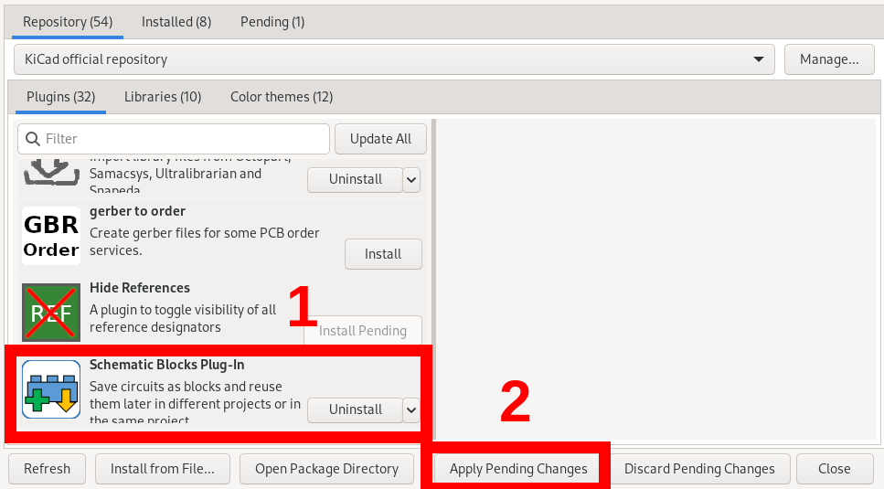
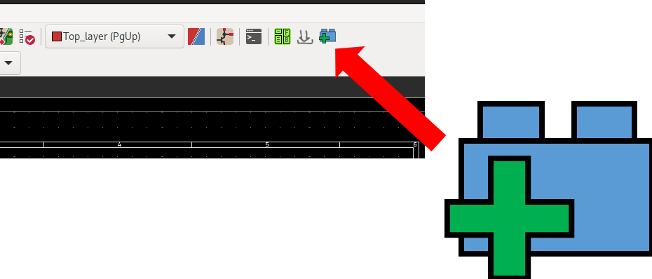
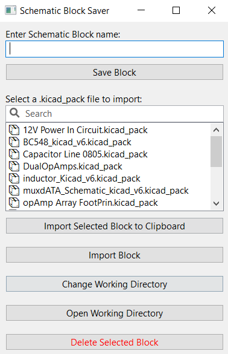

      

# KiCAD Schematic Blocks Plug-In

A plug-in can be used to save circuits as blocks. Then these circuit blocks can be reused in different projects. This plug-in aims to reduce schematic drawing time significantly. 

## Quick Start 

To create a schematic block, first, select the circuit and copy it to the clipboard (Ctrl+C). Then open up the plug-in and give it a name by writing it in the text field at the top. Click the “Save Block” Button to save it in the working directory. If you want to change the working directory, you can click the “Change Working Directory” button. All the blocks are saved in the working directory. Also, all the blocks in that directory will be listed in the List box. 

To import a Schematic Block to the project, first, select the Block in the plugin and click “Import Selected Block to Clipboard”. Go to the schematic and paste it on the sheet. 

## How to Install 

KiCAD Schematic Block Plug-In can be installed through KiCAD 📦PCM. Open PCM and search for the “Schematic Blocks Plug-in” in the Plugins section. Then press install. To apply the changes, click the “Apply Pending Changes Button” at the bottom.  

## Instructions for Use

To launch the plug-in go to PCB Editor and press the following icon.

This will open a window as follows, This window is used to save and reuse the schematic blocks. 

As a first step, it is recommended to create a working folder on the computer to store all the schematic blocks. After creating a working folder, click the **“Change Working Directory“** button. Then navigate to the newly created folder and click Open. Now all the blocks created are saved in this folder. 

To create a schematic block, first, select the circuit in the schematic editor that you need to save as a block. Copy it to the clipboard by pressing Ctrl+C or by right-clicking and clicking the copy option. 

Secondly, open the plug-in, and give a block a name. You can write it in the **“Enter Schematic Block Name”** section at the top. Then press **“Save Block”** to save it.  Now that circuit part you copied to the clipboard will save as a ***.kicad_pack*** file in the working directory. 

Like this, you can save as many blocks as possible. When you need to import a circuit block into a schematic, select it from the List box and click the **“Import Selected Block to Clipboard”** button. Then, paste it on the schematic.  

## ⚠️Warnings 

- Make sure to have the same libraries included in the project that are used to create the circuit in the Schematic Block.  Including the foodprint libraries, which are linked to design block circuit components. 

- You can use a design block created in KiCad V6 in KiCad V7. But you can't use it the other way around. That means you can't use the design block created in KiCad V7 in KiCad V6 projects. 

- Be careful when saving entire hierarchical sheets into blocks. It is possible. But I had some issues when transferring through KiCad versions. 

:)
